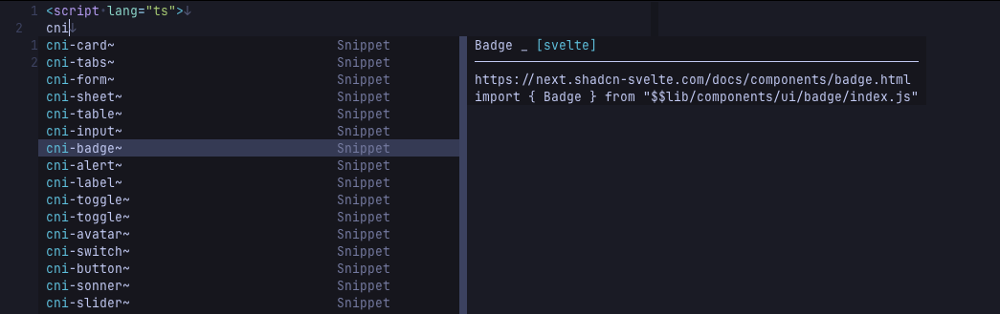
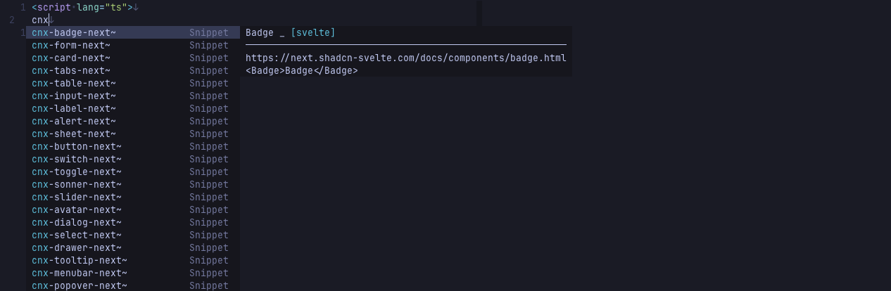

# Snippets for shadcn-svelte

Collection of snippets for [shadcn-svelte-next](https://next.shadcn-svelte.com/). Courtesy of [selemondev's vscode-shadcn-svelte](https://github.com/selemondev/vscode-shadcn-svelte)

## Why

I like shadcn-svelte and neovim, and I need snippets to go fast!

## Usage

| Snippet           | Description                            |
| ----------------- | -------------------------------------- |
| `cni-[component]` | Adds imports for the component         |
| `cnx-[component]` | Adds markup for the component         |





## Install

Any plugin manager will work. I use Lazy.nvim with LuaSnip. Don't hesitate to contribute with instructions on how to use your preffered plugin manager/snippet engine.

### Lazy.nvim

```lua
{ "phishbacon/shadcn-svelte-snippets" }
```

> [!WARNING]
> If you're using LuaSnip make sure to use
> `require("luasnip.loaders.from_vscode").lazy_load()`, and add
> `shadcn-svelte-snippets` as a dependency for LuaSnip, otherwise snippets might not
> be detected. If you don't use `lazy_load()` you might notice a slower
> startup-time
>
> ```lua
> {
>   "L3MON4D3/LuaSnip",
>   dependencies = { "phishbacon/shadcn-svelte-snippets" },
> }
> ```


